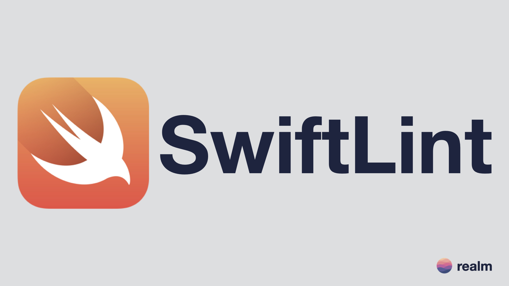
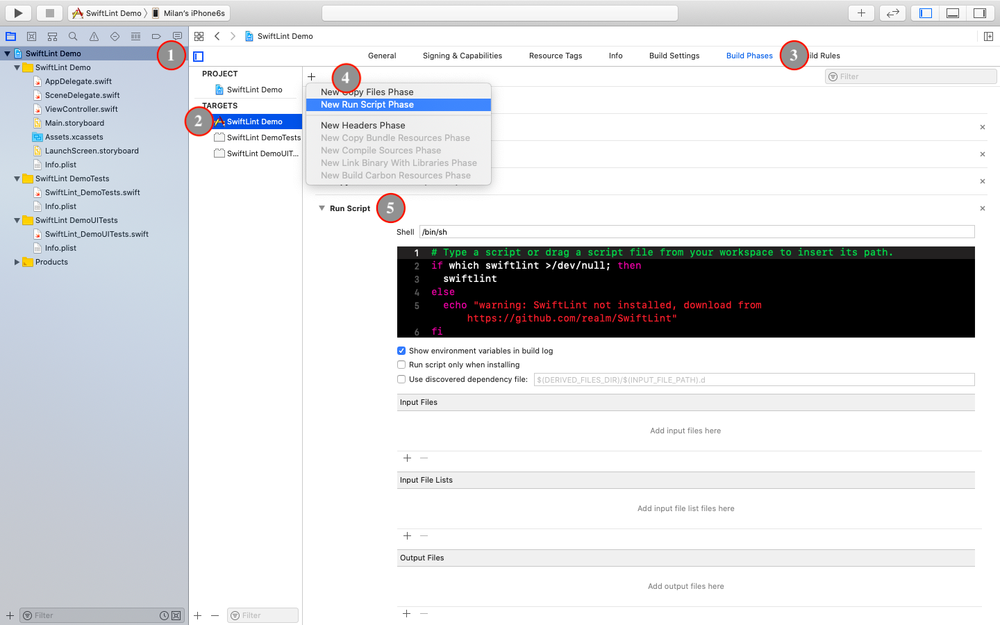
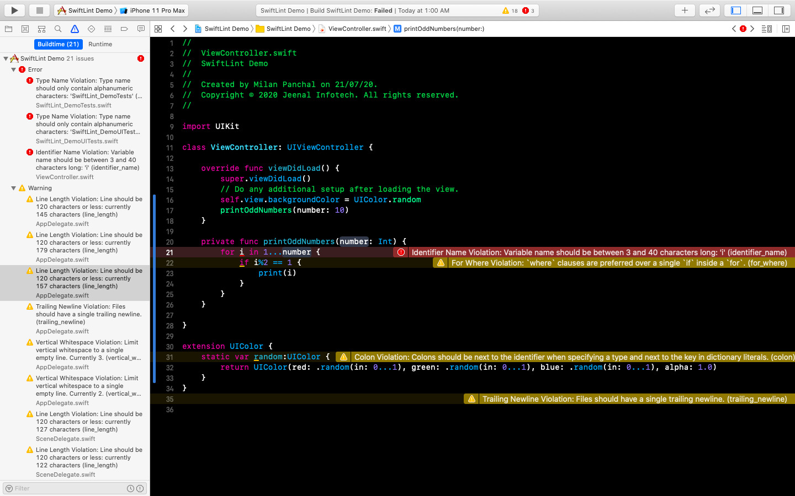

# SwiftLint Demo

SwiftLint Demo project written in Swift 5 and Xcode Version 11.3.1 (11C504).

[SwiftLint](https://github.com/realm/SwiftLint) is a tool to enforce Swift style and conventions, loosely based on [GitHub's Swift Style Guide](https://github.com/github/swift-style-guide).

## Blog
You can read more about **How to enforce Swift style and conventions into the project using SwiftLint? ** by visiting following link.

https://medium.com/@milanpanchal24/how-to-enforce-swift-style-and-conventions-into-the-project-using-swiftlint-7588b4ffba66

## Preview

## Author

**Milan Panchal**, follow me on:

1. **Twitter** ([@milan_panchal24](https://twitter.com/milan_panchal24))
2. **Github** ([/milanpanchal](https://github.com/milanpanchal/))
3. **Medium** ([https://medium.com/@milanpanchal24](https://medium.com/@milanpanchal24))
4. **LinkedIn** ([/in/milanpanchal/](https://www.linkedin.com/in/milanpanchal/))
5. **LeedCode** ([/milanpanchal](https://leetcode.com/milanpanchal/))

License
----

MIT

**Free Software, Hell Yeah!**
